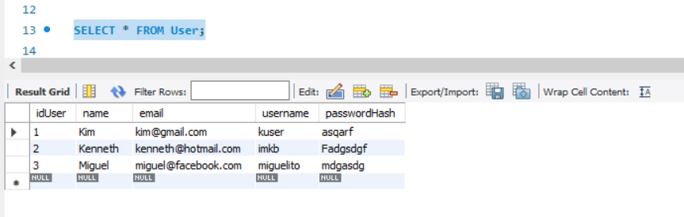
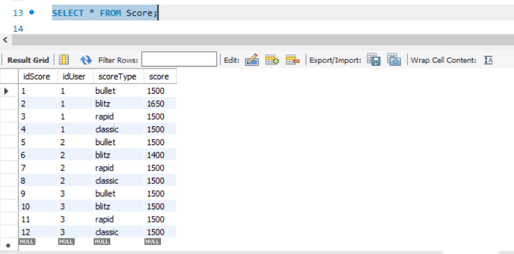

# mysql-workshop
Exploring SQL Language

## Setup

Follow steps provided in [How to install MySQL 8.0.30 Server and Workbench latest version on Windows 10](https://www.youtube.com/watch?v=2c2fUOgZMmY)

**Note: Add mysql path to environment variables so it can be used from terminal itself.**

### Verifying your setup

1. Login using workshop_admin user

**Note: I have created an admin user named workshop_admin. You could use any other that you created during setup**

```bash
mysql -u workshop_admin -p
```

<details><summary> output </summary>

```bash
C:\Users\Kenneth>mysql -u root -p
Enter password: **************
Welcome to the MySQL monitor.  Commands end with ; or \g.
Your MySQL connection id is 24
Server version: 8.0.33 MySQL Community Server - GPL

Copyright (c) 2000, 2023, Oracle and/or its affiliates.

Oracle is a registered trademark of Oracle Corporation and/or its
affiliates. Other names may be trademarks of their respective
owners.

Type 'help;' or '\h' for help. Type '\c' to clear the current input statement.
```
</details><br/>

---

2. Show existing databases

```
show databases;
```

<details><summary> output </summary>

```bash
mysql> show databases;
+--------------------+
| Database           |
+--------------------+
| information_schema |
| mysql              |
| performance_schema |
| sys                |
+--------------------+
4 rows in set (0.00 sec)
```
</details><br/>

---

3. Create my first database

```
create database my_fisrt_db;
```

<details><summary> output </summary>

```bash
mysql> create database my_fisrt_db;
Query OK, 1 row affected (0.01 sec)
```
</details><br/>

---

4. Show my first database in list

```
show databases;
```

<details><summary> output </summary>

```bash
mysql> show databases;
+--------------------+
| Database           |
+--------------------+
| information_schema |
| my_fisrt_db        |
| mysql              |
| performance_schema |
| sys                |
+--------------------+
4 rows in set (0.00 sec)
```
</details><br/>


### Design

Below you can find the Entity Relationship Diagram built in MySQL Workbench.


Find attached [here](./resources//tables.ods) tables for this practice

## Hands on

---
* Deploy database, tables and triggers automatically by using [deploy_db.sh](./deploy_db.sh). You could also perform each query in case you want to observe closely what happens after each of them.


* You could use [populate_db.sh](./populate_db.sh) to populate tables on the just created database.

* Check and compare what values have been entered automatically and which have been created due to our queries on each table.

```
SELECT * FROM User;
```


```
SELECT * FROM Game;
```


```
SELECT * FROM GameDetails;
```


```
SELECT * FROM Score;
```


* Finally you can drop the workshop db by running [drop_db.sh](./drop_db.sh) script