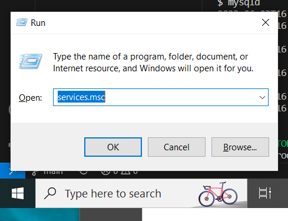
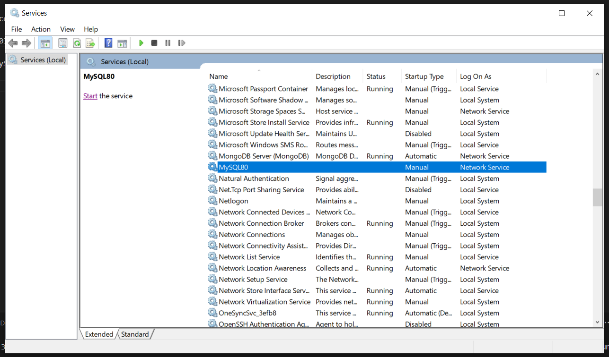
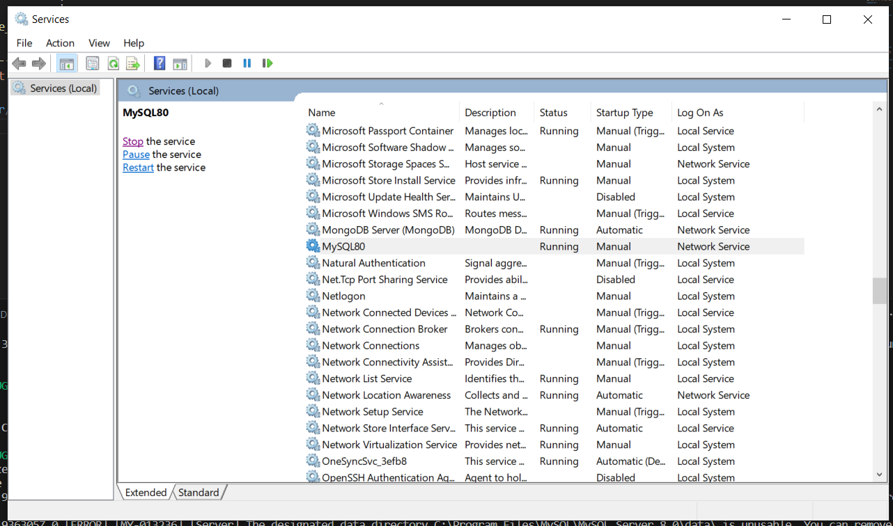

error
```
$ mysql -u root -p
Enter password: **************
ERROR 2003 (HY000): Can't connect to MySQL server on 'localhost:3306' (10061)
```

solution

* Open Services window by pressing Windows+R, enter services.msc and click on ok



* Find out MySQL right click and select start



* you should see MySQL service running
